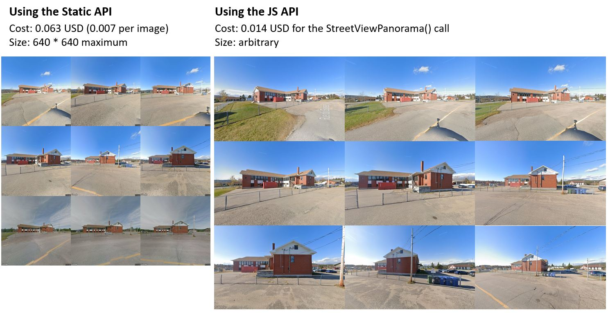

# Scrape better and cheaper Street View images from the JS API

Program to scrape Street View images through the Maps JS API.




Features:
- Cheap scraping of Street View images (0.014 USD per location - theoretically lowerable to 0.014 USD for any number of locations if you extend this).
- Automatically get multiple angles and different time periods for a location.
- Arbitrarily sized images without watermarks.
  

Check the blog post for a full breakdown: [https://loichovon.com/posts/streetview-scraper.html](https://loichovon.com/posts/streetview-scraper.html)


## Setup

```sh
python -m venv .venv
.venv\Scripts\active # Windows
source .venv\bin\activate # Mac/Linux
pip install requirements.txt
```

Copy the example `.env` file and enter your Maps API key.
```sh
cp .env.example .env 
```


## Usage

```sh
usage: client.py [-h] [-n NUM_WORKERS] [-b] [coords ...]

positional arguments:
  coords                (id, lat, lng) tuple (optional)

optional arguments:
  -h, --help            show this help message and exit
  -n NUM_WORKERS, --num-workers NUM_WORKERS
  -b, --show-browser
```

## Example

Scrape a location 

```sh
python .\client.py 'example' 45.5776760335504, -73.552595184348 
```

Scrape the 10 test locations. You may want to extend this and give your own list of location or fetch them from a database or file.

```sh
python .\client.py 
```

Scrape the 10 test locations using 2 parallel processes 

```sh
python .\client.py -n 2
```

Change `client.py` to get coordinates of your locations of interest from a file or a database and scrape away!